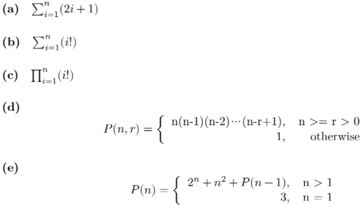

# Excercise

Responsibility of the students in this part:

- Complete all the exercises with the knowledge from Part I.
- Ask your lecturer if you have any question.
- Submit your solutions according to your lecturer requirement.

## exercise 1

Using iteration, define the functions to:

- (a) Compute factorial of n.
- (b) Compute x^n.
- (c) Count the number of digits of a positive integer number.
- (d) Check an positive integer number is prime or not.
- (e) Find the Greatest Common Divisor (GCD) of 2 positive integer numbers. (Using Euclid algorithm)

## exercise 2

Using recursion, define the functions to:

- (a) Compute factorial of n.
- (b) Compute x^n.
- (c) Count the number of digits of a positive integer number.
- (d) Find the Greatest Common Divisor (GCD) of 2 positive integer numbers. (Using Euclid algorithm)

## exercise 3

Define a recursive function `public static boolean checkPrime(int n, int d)` that check whether a number is prime (d is current divisor to check)

## exercise 4

Define a recursive function to calculate the following expressions:

## exercise 5

Define a recursive function to convert a Decimal number to Binary. (The output must be an integer number. Example with input is 8, output must be an integer number 1000).

## exercise 6

Using iteration, define the functions to:

- (a) Find and return the minimum element in an array. The array and its size are given as parameters.
- (b) Compute and return the sum of all elements in an array. The array and its size are given as parameters.
- (c) Count how many even numbers are there in an array. The array and its size are given as parameters.

## exercise 7

Using recursion, define the functions to:

- (a) Find and return the minimum element in an array. The array and its size are given as parameters.
- (b) Compute and return the sum of all elements in an array. The array and its size are given as parameters.
- (c) Count how many even numbers are there in an array. The array and its size are given as parameters.

## exercise 8

Using Linked List in Lab 1 for this exercise.

- (a) Implement method addSortedList(E item) to insert new element to a sorted linked list, that means we have to find the first node whose value is bigger than item and insert before it.
- (b) Suppose we have a linked list contains integer numbers, do the following requirements:
  - Count all even numbers.
  - Sum all numbers.

# Reference

[1]. [https://www.cs.odu.edu/toida/nerzic/content/recursive_alg/rec_alg.html](https://www.cs.odu.edu/toida/nerzic/content/recursive_alg/rec_alg.html)

[2]. [https://web.stanford.edu/class/archive/cs/cs106b/cs106b.1178/lectures/7-IntroToRecursion/7-IntroToRecursion.pdf](https://web.stanford.edu/class/archive/cs/cs106b/cs106b.1178/lectures/7-IntroToRecursion/7-IntroToRecursion.pdf)
