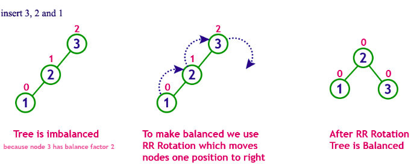
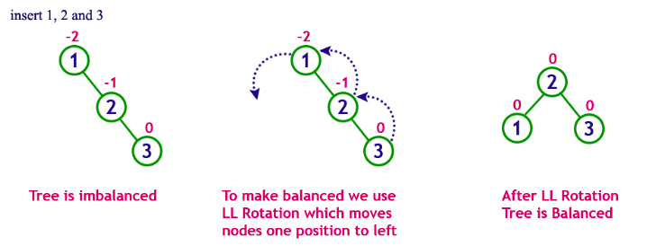
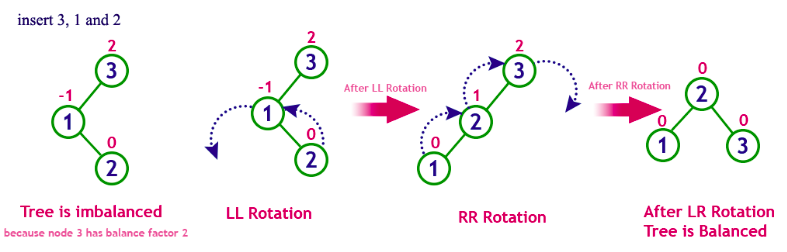
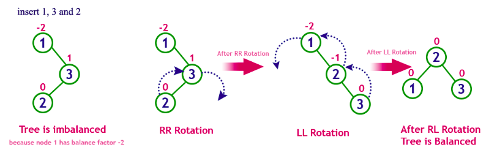

# AVL

## introduction

AVL is the abbreviation of the Russian authors Adelson-Velskii and Landis (1962) who defined the balanced tree.

An AVL tree is the same as a binary search tree, except that for every node, the height of the left and right subtrees can differ only by 1

This difference is called **Balance** Factor. When the Balance Factor > 1, the tree will be **rebalanced**.

## Node of a AVL tree

we add one more attribute which is called height to the Node class (same with BST). This attribute will help us access the height of the node faster.

```java
public class Node {
    Integer key;
    Node left, right;
    int height;

    public Node(Integer key) {
        this.key = key;
        this.height = 0;
        this.left = this.right = null;
    }
}
```

in AVL class

```java
public int height(Node node) {
    if (node == null) {
        return -1;
    }
    return node.height;
}

```

## check balance factor

```java
private int checkBalance(Node x) {
    return height(x.left) - height(x.right);
}
```

## rotation

The insert or delete operation may make the AVL tree come to imbalance.

A simple modification of the tree, called rotation, can restore the AVL property

### left-left rotation

When a new node is inserted into a AVL tree and makes it a right-right-unbalancedtree.

The tree can be re-balanced using left rotation as following:



This is the code of left rotation:

```java
private Node rotationLeft(Node x) {
    Node y = x.right;
    x.right = y.left;
    y.left = x;

    x.height = 1 + Math.max(height(x.left), height(x.right));
    y.height = 1 + Math.max(height(y.left), height(y.right));
    return y;
}
```

### right-right rotation

When a new node is inserted into a AVL tree and make it a left-left-unbalanced-tree.

The tree can be re-balanced using right rotation as following:



```java
private Node rotationRight(Node x) {
    Node y = x.left;
    x.left = y.right;
    y.right = x;

    x.height = 1 + Math.max(height(x.left), height(x.right));
    y.height = 1 + Math.max(height(y.left), height(y.right));
    return y;
}
```

### left-right rotation

When a new node is inserted into a AVL tree and make it a left-right-unbalancedtree.

The tree can be re-balanced using left-right rotation



```java

```

### right-left rotation

When a new node is inserted into a AVL tree and make it a right-left-unbalancedtree.

The tree can be re-balanced using right-left rotation.



```java

```

## balance

This is the code to re-balance the tree:

```java
private Node balance(Node x) {
    if (checkBalance(x) < -1) {
        if (checkBalance(x.right) > 0) {
            x.right = rotateRight(x.right);
        }
            x = rotateLeft(x);
        }
        else if (checkBalance(x) > 1) {
            if (checkBalance(x.left) < 0) {
                x.left = rotateLeft(x.left);
            }
            x = rotateRight(x);
    }
    return x;
}
```

## exercises

### 1 Complete the class to build the AVL tree. You can re-use the BST code in the previous lab (insertion, deletion).
