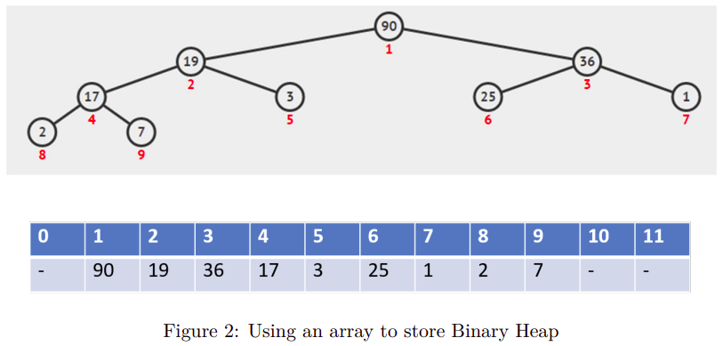

# Binary Heap

## 1. What is binary heap?

A heap is a special tree-based data structure in which the tree is a complete binary tree. Generrally, Heaps can be of two types:

- Max heap: A[parent(i)] >= A[i]
- Min heap: A[parent(i)] <= A[i]


For storing a complete binary tree, we can use an array



index 0 can be used or not, and the corresponding parent-children relation formlas my be different

|           | Root at index 0 | Root at index 1 |
| :-------- | :-------------: | :-------------: |
| parent(i) |     (i-1)/2     |      (i/2)      |
| left(i)   |    (2\*i)+1     |     (2\*i)      |
| right(i)  |    (2\*i)+2     |    (2\*i)+1     |

We will implement max-heap by using an array that starts at index 1

Two basic operations of max-heap are:

- `insert`
- `extract max`

## construct a heap class

```java
public class MaxHeap {
    int[] heap;
    int heapSize;
    int maxSize; //maximum size to initialize an heap array

    public MaxHeap(int capity){
        heapSize = 0;
        this.maxSize = capity + 1;
        heap = new int[maxSize];
        heap[0] = -1;
    }
}
```

```java
private int parent(int i) {
    return i / 2;
}
```

```java
private int left(int i) {
    return (2 * i);
}
```

```java
private int right(int i) {
    return (2 * i) + 1;
}
```

```java
private void swap(int i, int j) {
    int temp = heap[i];
    heap[i] = heap[j];
    heap[j] = temp;
}
```

## 3. Insert

We have three step to do:

- increse heap size by 1
- add a new key at a heap size position
- if new key is smaller than its parent, then we don't need to do anything. if not, **shift it up**

```java
public void insert(int key) {
    if (heapSize == maxSize) {
        throw new NoSuchElementException("Overflow Exception");
    }
    heapSize += 1;
    heap[heapSize] = key;
    shiftUp(heapSize);
}

// shiftUp ???

private void shiftUp(int i) {
    while (i > 1 && heap[parent(i)] < heap[i]) {
        swap(parent(i), i);
        i = parent(i);
    }
}
```

## Extract max

```java

public int extractMax() {
    if (heapSize == 0) {
        throw new NoSuchElementException("Underflow Exception");
    }
    int max = heap[1];
    heap[1] = heap[heapSize];
    heapSize -= 1;
    shiftDown(1);
    return max;
}

// shiftDown ???

private void shiftDown(int i) {
    while (i <= heapSize) {
        int max = heap[i];
        int maxId = i;

        if (left(i) < heapSize && max < heap[left(i)]) {
            max = heap[left(i)];
            maxId = left(i);
        }
        if (right(i) < heapSize && max < heap[right(i)]) {
            max = heap[right(i)];
            maxId = right(i);
        }
        if (maxId != i) {
            swap(maxId, i);
            i = maxId;
        } else {
            break;
        }
    }
}
```

## 5. Heap sort

```java
// HeapSort(array)
// BuildHeap(array)
// for i <- 0 -> n-1 do
//     A[i] = ExtracMax()
// end
// return A

public static void HeapSort(int[] array) {
    //
}
```

## 6. Exercise

### 1 Complete the max-heap class following the instructions in this lab.

### 2 Implement the min-heap of intergers.

### 3 Sort the following numbers accending/ descending by using heap sort:

`15, 23, 18, 63, 21, 35, 36, 21, 66, 12, 42, 35, 75, 23, 64, 78, 39`

### 4 Define the priority queue to queue some people. A person has name and priority number. Given that: higher priority = higher number. Perform these operations:

- Enqueue: (Alex, 3), (Bob, 2), (David, 6), (Susan, 1)
- Dequeue
- Enqueue: (Mike, 5), (Kevin, 4)
- Dequeue
- Dequeue
- Enqueue: (Helen, 0), (Paul, 8), (Iris, 7)
- Dequeue

Show the result of 4 persons will be dequeued.
